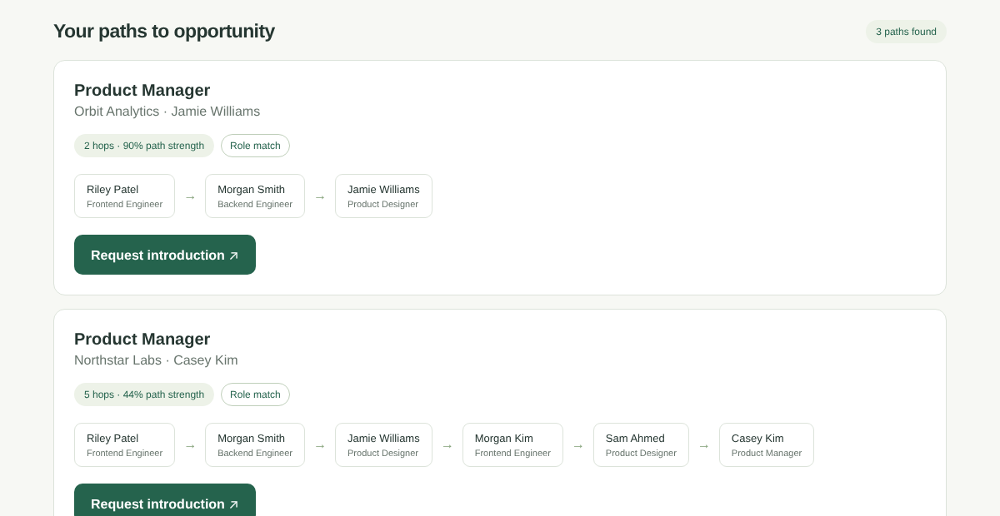
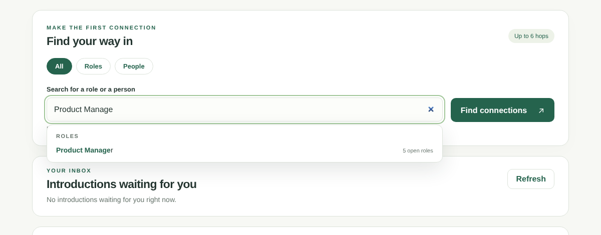

# GitConnectd

**Find your next job through the people you already know.** GitConnectd finds the strongest chain of real relationships between you and a hiring manager, in six introductions or fewer, then passes a warm introduction down that chain one person at a time.



## Why

Most hires come through referrals, but most people apply cold, because they don't know who in their extended network could vouch for them. Research on "weak ties" shows that jobs often come through acquaintances rather than close friends, and that almost anyone is only a few introductions away.

GitConnectd makes that network searchable. Search for a role or a person, see the most trusted path to them, and request an introduction. Each person on the path gets a message, accepts or declines, and the request moves on until it reaches the hiring manager.

## Features

- **Strongest path, not shortest.** Paths are ranked by how well each pair actually knows each other, so a 4-hop chain of close colleagues can beat a 2-hop chain through a stranger.
- **Search as you type.** Suggestions for open roles and hiring managers appear while you type, and results update without pressing Enter. Filter by **All**, **Roles** or **People**.
- **Warm introductions, hop by hop.** Request an introduction along a path; each person accepts or declines from their inbox, and the request moves to the next person.
- **Accounts with profiles.** Sign up with a job title, company, bio, phone and GitHub username. Hiring managers can post an open role at sign-up.
- **Your connections.** Add the people you know and say how well you know them (from "met once" to "close"). New paths appear in your next search.
- **Privacy by default.** Email and phone stay private; each email, phone number and GitHub account can belong to only one person.
- **Light and dark mode.** Follows your device setting, with a switch in the header.



## How the path finding works

People are nodes in a graph and connections are edges. Each connection has a **strength** from 0 to 1 (1 = very close). A path's score is all its strengths multiplied together, roughly "the chance every person passes the introduction on."

1. **Load only the nearby network.** Any path of 6 or fewer hops stays within 3 steps of the seeker or 3 steps of a hiring manager, so we expand 3 rounds from each side and the two areas meet in the middle. On a 20,000-person test network, a search loads about 8,000 of 100,000 connections.
2. **Hop-limited Dijkstra.** Each edge costs `-log(strength)`, which turns "multiply strengths and find the biggest" into "add costs and find the smallest," exactly what Dijkstra's algorithm does. Plain Dijkstra ignores path length and often finds strong paths 8–16 hops long that break the six-degrees limit, so our version tracks hop count and finds the strongest path *within* 6 hops.
3. **Early stop.** Routes come off the priority queue strongest first, so the search stops as soon as it has found the top 3 hiring managers. That took a broad search on the test network from about 400 ms to 2 ms.

The search is checked against an independent brute-force method in the test suite.

## Tech stack

| Part | Technology |
| --- | --- |
| Backend API | Python, FastAPI, Uvicorn |
| Graph search | NetworkX graphs with a custom hop-limited Dijkstra |
| Database | MariaDB (MySQL 8.0.16+ also works), PyMySQL |
| Frontend | Plain HTML, CSS and JavaScript, served by FastAPI (no build step) |
| Auth | Salted PBKDF2 password hashes and signed login tokens (Python standard library) |
| Tests | pytest, 79 tests |

## Project layout

```
├── backend/
│   ├── app/
│   │   ├── main.py            FastAPI app; serves the API and the frontend
│   │   ├── graph.py           neighborhood loading and hop-limited Dijkstra
│   │   ├── db.py              database connection helpers
│   │   ├── security.py        password hashing and login tokens
│   │   └── routes/            auth, connections, search, intros
│   ├── demo_setup.py          prepares demo accounts along a strong path
│   ├── set_password.py        gives one user a password
│   └── test_*.py              tests
├── frontend/                  index.html and assets/ (app.js, style.css)
├── db/
│   ├── schema.sql             all tables
│   └── seed.py                generates a synthetic network
└── Resources/                 screenshots
```

## Getting started

You need **Python 3.10+** and **MariaDB 10.5+** (or MySQL 8.0.16+). Run these commands from the repository root.

### 1. Create the database

Create a database user for the app. On Fedora and some other Linux systems, MariaDB's `root` can only sign in with `sudo`, so a separate user is required:

```bash
sudo mariadb -e "CREATE USER 'sixdegrees'@'localhost' IDENTIFIED BY 'choose-a-password';
                 GRANT ALL PRIVILEGES ON six_degrees.* TO 'sixdegrees'@'localhost';"
mariadb -u sixdegrees -p < db/schema.sql
```

The database is called `six_degrees` (the project's original name).

### 2. Configure

```bash
cp .env.example .env
python -c "import secrets; print(secrets.token_hex(32))"   # a random AUTH_SECRET
```

Edit `.env`: set `DB_PASSWORD` to the password you chose and `AUTH_SECRET` to the random value. `.env` is ignored by Git, so your password stays on your machine.

### 3. Install

```bash
python -m venv .venv
source .venv/bin/activate          # Windows: .venv\Scripts\activate
pip install -r backend/requirements.txt -r db/requirements.txt
```

### 4. Load sample data

```bash
MYSQL_USER=sixdegrees MYSQL_PASSWORD=choose-a-password python db/seed.py --seed 42
```

This adds 100 people, 300 connections and 30 open roles. Each run adds a new, separate network, so reload `db/schema.sql` first if you want to start over. See [db/README.md](db/README.md) for options.

### 5. Run

```bash
python -m uvicorn app.main:app --app-dir backend --port 8000
```

Open **http://localhost:8000**. Interactive API docs are at **http://localhost:8000/docs**.

## Trying the demo

Seeded people have no passwords. This script picks a strong 2–3 hop path, gives everyone on it a readable email and the password `demo1234`, clears old introductions between them, and prints step-by-step instructions:

```bash
cd backend
python demo_setup.py                    # or: --role "Backend", --hops 3, --seeker 12
```

Then:

1. Sign in as the **job seeker** it prints.
2. Search for the role it suggests and click **Request introduction** on the path to the hiring manager.
3. In a **private browser window**, sign in as each person on the path in turn and click **Accept introduction**. When the hiring manager accepts, the introduction is complete.

You can also create your own account, add a few connections under **Your connections**, and search from your own profile.

## API

| Method | Endpoint | What it does |
| --- | --- | --- |
| POST | `/auth/signup` | Create an account (name, email, password; optional profile, phone, GitHub, open role) |
| POST | `/auth/login` | Sign in; returns a token |
| GET | `/auth/me` | The signed-in user |
| GET | `/search/suggest?q=` | Roles and hiring managers matching what's typed |
| GET | `/search?seeker_id=&q=&search_type=` | Strongest paths; `search_type` is `all`, `role` or `manager`; optional `manager_id` |
| GET | `/users/lookup?q=` | People by name |
| GET / POST | `/me/connections` | List or add your connections (closeness 1–5) |
| DELETE | `/me/connections/{id}` | Remove a connection |
| POST | `/intros` | Start an introduction along a path |
| GET | `/intros/{id}` | A request's status and messages |
| GET | `/inbox/{user_id}` | Introductions waiting for a person |
| POST | `/intros/{id}/respond` | Accept or decline |

Endpoints under `/auth/me` and `/me/` need the header `Authorization: Bearer <token>`.

## Tests

```bash
cd backend
python -m pytest -q
```

Most tests use your database and clean up after themselves; they're skipped if the database isn't reachable.

## Sharing it

To let others try your running copy, [ngrok](https://ngrok.com) can give it a public HTTPS address:

```bash
ngrok http 8000
```

Your computer is the server, so it has to stay awake and online.

## Limitations and what's next

- **Introductions trust the user ID they're given.** The intro endpoints don't yet check who's signed in. Next: require sign-in and use the token's user.
- **Connections are one-sided.** Adding someone doesn't need their confirmation. Next: connection requests that the other person accepts.
- **Strength comes from self-rating only.** Next: score ties from shared employers, GitHub co-contributions and email or calendar signals (with consent).
- **Introduction messages use a template.** Next: AI-drafted messages tailored to each relationship.
- **Profiles can't be edited after sign-up** yet.
- **Sample data is synthetic.** Next: seed from real, opt-in communities such as a university alumni network or a hackathon's attendees.

## Team

Built at a hackathon by *(add team members here)*.

## License

[Apache 2.0](LICENSE)
