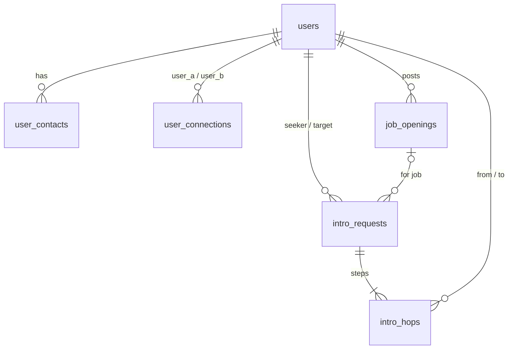

# Database schema

GitConnectd stores everything in MariaDB (MySQL-compatible), database `six_degrees`. The source of truth is [`schema.sql`](schema.sql); this page is a quick reference.

## Tables at a glance

| Table | Stores | Columns | Keys and rules |
|---|---|---|---|
| `users` | Profiles, logins, who's hiring | id, first_name, last_name, email, password_hash, job_title, company, bio, location, is_hiring, created_at, updated_at | `email` unique; `password_hash` NULL for seeded demo users; indexes on job_title, is_hiring |
| `user_contacts` | Extra phones, emails and links | id, user_id → users, contact_type, value, is_public | (contact_type, value) unique |
| `user_connections` | Who knows whom, and how well | id, user_a_id → users, user_b_id → users, strength, source, context, confirmed, created_at | one row per pair (`user_a_id < user_b_id`); 0 < strength ≤ 1 |
| `job_openings` | Roles posted by hiring managers | id, posted_by → users, title, company, description, is_open, created_at | full-text index on (title, description) |
| `intro_requests` | One introduction sent down a path | id, seeker_id → users, target_id → users, job_id → job_openings, path_json, current_hop, status, pitch, created_at, updated_at | `job_id` set to NULL if the job is deleted |
| `intro_hops` | Each step of a request and its answer | id, request_id → intro_requests, hop_index, from_user_id → users, to_user_id → users, message, status, responded_at | (request_id, hop_index) unique; (to_user_id, status) index for the inbox |

Every foreign key to `users` cascades, so deleting a person removes their contacts, connections, job posts and introductions.

## Enum values

| Column | Values |
|---|---|
| `user_contacts.contact_type` | phone, email, linkedin, github, website, other |
| `user_connections.source` | self_rated, coworker, github, contacts, inferred |
| `intro_requests.status` | pending, completed, declined |
| `intro_hops.status` | pending, accepted, declined |

## How the app uses it

- **Path search:** `user_connections.strength` becomes the graph edge cost, `−log(strength)`. In the app, a closeness rating of 1–5 maps to a strength of 0.2–1.0.
- **Contacts:** phones are stored as digits only (a 10-digit number gets a leading 1), and GitHub usernames are lowercased, so the unique key catches duplicates.
- **Introductions:** `path_json` holds the ids along the path, `[seeker, …, hiring manager]`. `current_hop` points at whoever must answer next, and each step adds a row to `intro_hops`.

## Relationships

